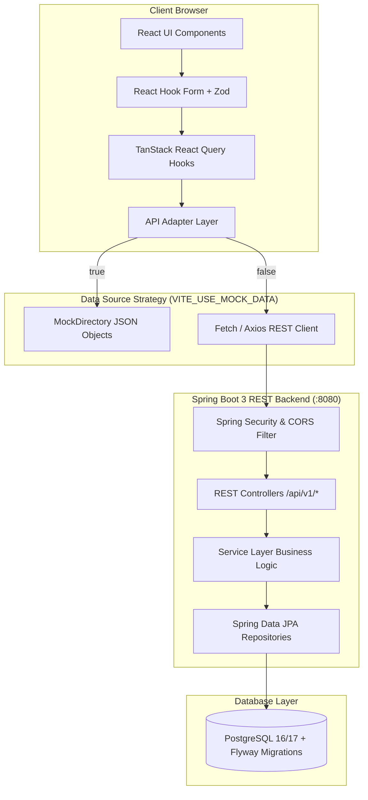

# 📘 Insight Pest Solutions - Complete Hands-on Project Guide & Codebase Walkthrough

Welcome to the definitive architecture and codebase guide for the **Insight Pest Solutions** enterprise platform. This document provides a file-by-file breakdown, architectural deep-dive, data lifecycle traces, and hands-on developer guides for every single component across both the Frontend and Backend systems.

---

## 📑 Table of Contents
1. [Executive Summary & Technology Stack](#1-executive-summary--technology-stack)
2. [High-Level Architecture & End-to-End Data Flow](#2-high-level-architecture--end-to-end-data-flow)
3. [Full Project Directory Structure](#3-full-project-directory-structure)
4. [Frontend Architecture & File-by-File Breakdown (`/Frontend`)](#4-frontend-architecture--file-by-file-breakdown-frontend)
   - [4.1 Build, Config & Infrastructure Files](#41-build-config--infrastructure-files)
   - [4.2 Decoupled Mock Layer (`/MockDirectory`)](#42-decoupled-mock-layer-mockdirectory)
   - [4.3 Application Entry & Configuration (`/src`)](#43-application-entry--configuration-src)
   - [4.4 State Management & Contexts (`/src/contexts`)](#44-state-management--contexts-srccontexts)
   - [4.5 API Layer & React Query Hooks (`/src/api` & `/src/hooks`)](#45-api-layer--react-query-hooks-srcapi--srchooks)
   - [4.6 UI Design System & Component Library (`/src/components`)](#46-ui-design-system--component-library-srccomponents)
   - [4.7 Layouts & Routing (`/src/layouts` & `/src/routes`)](#47-layouts--routing-srclayouts--srcroutes)
   - [4.8 Feature Modules & Pages (`/src/modules`)](#48-feature-modules--pages-srcmodules)
   - [4.9 TypeScript Domain Models & Utility Functions (`/src/types` & `/src/utils`)](#49-typescript-domain-models--utility-functions-srctypes--srcutils)
5. [Backend Architecture & File-by-File Breakdown (`/Backend`)](#5-backend-architecture--file-by-file-breakdown-backend)
   - [5.1 Build, Configuration & Profiles](#51-build-configuration--profiles)
   - [5.2 Application Entry, Security & Seeding](#52-application-entry-security--seeding)
   - [5.3 Common Infrastructure & Exception Handling (`/common`)](#53-common-infrastructure--exception-handling-common)
   - [5.4 Feature Modules Deep-Dive (`/modules`)](#54-feature-modules-deep-dive-modules)
6. [Data Lifecycles & Real-World Interaction Traces](#6-data-lifecycles--real-world-interaction-traces)
   - [Trace 1: Interactive Multi-Step Inspection Booking](#trace-1-interactive-multi-step-inspection-booking)
   - [Trace 2: Instant Quote Request & Lead Generation](#trace-2-instant-quote-request--lead-generation)
   - [Trace 3: Switching Between Mock Mode and Spring Boot Backend](#trace-3-switching-between-mock-mode-and-spring-boot-backend)
7. [Docker & Container Orchestration (`docker-compose.yml`)](#7-docker--container-orchestration-docker-composeyml)
8. [Hands-on Local Development & Verification Guide](#8-hands-on-local-development--verification-guide)

---

## 1. Executive Summary & Technology Stack

**Insight Pest Solutions** is a modern, enterprise-grade web application created for a full-service residential and commercial pest management company. It delivers a fast customer-facing experience (service exploration, pest identification encyclopedia, instant quote estimation, real-time inspection scheduling) and an administrative control panel for managing inbound customer requests.

### Core Stack Highlights

```
┌─────────────────────────────────────────────────────────────────────────┐
│                           FRONTEND STACK                                │
│  React 18 + TypeScript + Vite + React Router 6 + TanStack Query         │
│  Tailwind CSS + Lucide Icons + React Hook Form + Zod Validation         │
└────────────────────────────────────┬────────────────────────────────────┘
                                     │ (REST JSON API / Mock Adapter)
┌────────────────────────────────────▼────────────────────────────────────┐
│                           BACKEND STACK                                 │
│  Java 17/21 + Spring Boot 3.3 (Web, Data JPA, Validation, Security)    │
│  Swagger OpenAPI 3 + Hibernate + PostgreSQL 16/17 + Flyway Migrations    │
└────────────────────────────────────┬────────────────────────────────────┘
                                     │
┌────────────────────────────────────▼────────────────────────────────────┐
│                           DEVOPS & INFRA                                │
│  Docker Multi-Stage Builds + Nginx SPA Alpine + Docker Compose          │
└─────────────────────────────────────────────────────────────────────────┘
```

---

## 2. High-Level Architecture & End-to-End Data Flow



---

## 3. Full Project Directory Structure

```text
Insight Pest/
├── .gitignore                      # Git ignore patterns for Node, Java, IDEs, and OS files
├── README.md                       # High-level project documentation and quickstart
├── docker-compose.yml              # Multi-container orchestration (Frontend, Backend, Postgres)
├── PROJECT_WALKTHROUGH.md          # Comprehensive codebase manual (this document)
│
├── Backend/                        # Spring Boot 3.3 Maven REST API Project
│   ├── pom.xml                     # Maven dependency definitions & build plugins
│   ├── Dockerfile                  # Multi-stage JDK 17 build & JRE 17 runtime container
│   ├── README.md                   # Backend specific documentation
│   └── src/
│       ├── main/
│       │   ├── java/com/insightpest/
│       │   │   ├── InsightPestApplication.java  # Spring Boot main class
│       │   │   ├── config/                      # CORS, OpenAPI, and DB Data Seeder
│       │   │   ├── security/                    # Spring Security configuration
│       │   │   ├── common/                      # Common ApiResponse, PageResponse, Exceptions
│       │   │   └── modules/                     # Domain modules (Entities, DTOs, Repos, Services, Controllers)
│       │   │       ├── services/                # Pest control service catalog
│       │   │       ├── pests/                   # Pest biology library
│       │   │       ├── locations/               # Branch coverage areas
│       │   │       ├── bookings/                # Inspection slot reservations
│       │   │       ├── leads/                   # Quote and callback submissions
│       │   │       ├── contact/                 # Contact inquiries
│       │   │       ├── testimonials/            # Customer reviews
│       │   │       ├── faq/                     # Help center Q&As
│       │   │       ├── blog/                    # Articles & IPM guides
│       │   │       └── newsletter/              # Subscription mailing list
│       │   └── resources/
│       │       ├── application.yml              # Base Spring Boot configuration (Flyway enabled)
│       │       ├── application-dev.yml          # Dev profile (PostgreSQL configuration)
│       │       ├── application-prod.yml         # Prod profile (PostgreSQL configuration)
│       │       └── db/migration/                # Flyway SQL migrations (V1__initial_schema.sql)
│       └── test/                                # JUnit 5 and Spring Boot integration tests
│
└── Frontend/                       # React 18 + TypeScript + Vite Application
    ├── package.json                # NPM dependencies & build scripts
    ├── vite.config.ts              # Vite bundling configuration & dev server ports
    ├── tsconfig.json               # TypeScript compiler rules & path aliases
    ├── tsconfig.node.json          # Node configuration for Vite config
    ├── tailwind.config.js          # Tailwind CSS utility definitions & theme extensions
    ├── postcss.config.js           # PostCSS plugins (Tailwind & Autoprefixer)
    ├── index.html                  # HTML5 entrypoint with Google Fonts & SEO meta tags
    ├── nginx.conf                  # Nginx web server configuration for production SPA routing
    ├── Dockerfile                  # Multi-stage Node 18 build + Nginx Alpine runner
    ├── .env                        # Local active environment variables
    ├── .env.example                # Example environment template
    ├── MockDirectory/              # Decoupled mock database for mock mode
    └── src/
        ├── main.tsx                # React DOM entry point
        ├── App.tsx                 # Root React component (providers, router wrapper)
        ├── index.css               # Global styles, Tailwind directives, design tokens
        ├── config/                 # Static brand settings, company metadata, navigation
        ├── types/                  # TypeScript interface definitions for all domains
        ├── api/                    # Decoupled API adapters (Mock vs HTTP)
        ├── hooks/                  # TanStack React Query custom hooks
        ├── contexts/               # React Contexts (Auth, Toast notifications)
        ├── components/             # Atomic & composite reusable UI components
        ├── layouts/                # Public website and Admin dashboard layouts
        ├── routes/                 # React Router 6 declarative route hierarchy
        ├── modules/                # Feature pages (Home, Services, Pests, Admin, etc.)
        └── utils/                  # String formatters, CSS class merger, SEO meta helpers
```

---

## 4. Frontend Architecture & File-by-File Breakdown (`/Frontend`)

The Frontend is built as a single-page application (SPA) using React 18 and TypeScript with strict type checking.

### 4.1 Build, Config & Infrastructure Files

| File | Purpose & Role |
|---|---|
| [Frontend/package.json](file:///d:/Study/Coding/Insight%20Pest/Frontend/package.json) | Declares project dependencies: `react`, `react-dom`, `react-router-dom`, `@tanstack/react-query`, `lucide-react`, `clsx`, `tailwind-merge`, and dev dependencies (`vite`, `typescript`, `tailwindcss`, `postcss`, `autoprefixer`). |
| [Frontend/vite.config.ts](file:///d:/Study/Coding/Insight%20Pest/Frontend/vite.config.ts) | Vite build tool configuration. Configures the React plugin, sets the local dev server port to `5173`, and configures path aliases. |
| [Frontend/tsconfig.json](file:///d:/Study/Coding/Insight%20Pest/Frontend/tsconfig.json) | TypeScript compiler options: strict type checking, ES2020 target, JSX support, and module resolution. |
| [Frontend/tailwind.config.js](file:///d:/Study/Coding/Insight%20Pest/Frontend/tailwind.config.js) | Configures the brand color palette (Forest Emerald `#0D5C3A`, Bright Mint `#10B981`, Dark Slate `#0F172A`, Amber Gold `#F59E0B`), typography, font families (`Inter`, `Outfit`), and custom container settings. |
| [Frontend/postcss.config.js](file:///d:/Study/Coding/Insight%20Pest/Frontend/postcss.config.js) | Connects Tailwind CSS and Autoprefixer to the CSS compilation pipeline. |
| [Frontend/index.html](file:///d:/Study/Coding/Insight%20Pest/Frontend/index.html) | Root HTML shell. Preloads modern typography from Google Fonts (`Inter` and `Outfit`), sets responsive viewport meta tags, and mounts `<div id="root"></div>`. |
| [Frontend/nginx.conf](file:///d:/Study/Coding/Insight%20Pest/Frontend/nginx.conf) | Production Nginx server configuration. Provides gzip compression and `try_files $uri $uri/ /index.html;` to ensure deep-linking works properly in a client-routed SPA. |
| [Frontend/Dockerfile](file:///d:/Study/Coding/Insight%20Pest/Frontend/Dockerfile) | Multi-stage Docker container build. Stage 1 compiles TypeScript into optimized static JS/CSS assets (`npm run build`). Stage 2 serves the `/dist` directory via an ultra-lightweight `nginx:alpine` image on port 80. |
| [Frontend/.env](file:///d:/Study/Coding/Insight%20Pest/Frontend/.env) | Holds runtime environment variables: `VITE_API_BASE_URL=http://localhost:8080/api/v1` and `VITE_USE_MOCK_DATA=true`. |

---

### 4.2 Decoupled Mock Layer (`/MockDirectory`)

The `MockDirectory` lives outside `src/` as a clean mock dataset. When `VITE_USE_MOCK_DATA=true`, all API calls resolve against these datasets instantly with simulated latency without needing the backend or database to be running.

- **`company/companyData.json`**: General business profile, contact details, operating hours, emergency dispatch phone numbers, and license certifications.
- **`navigation/navigationData.json`**: Hierarchy of header menu links, service mega-menu items, and footer column structures.
- **`services/servicesData.json`**: Complete list of pest control services (e.g., General Pest Protection, Termite Interception, Rodent Exclusion, Bed Bug Heat Treatment, Mosquito Suppression, Commercial IPM) with pricing tiers, treatment features, and FAQs.
- **`pests/pestsData.json`**: Biological pest library data (Termites, Bed Bugs, German Cockroaches, Rodents, Carpenter Ants, Mosquitoes, Wasps, Fleas, Ticks) with scientific names, danger levels, identification traits, habit patterns, and treatment plans.
- **`locations/locationsData.json`**: Branch territories, coverage zip codes, branch manager details, local phone lines, and operating radius.
- **`testimonials/testimonialsData.json`**: Verified customer reviews with 5-star ratings, reviewer names, location tags, and timestamps.
- **`faq/faqData.json`**: Categorized customer questions regarding safety, pet-friendly products, warranties, pricing, and preparation.
- **`blog/blogData.json`**: Full-length informative pest management articles and DIY prevention guides.
- **`bookings/bookingSlotsData.json`**: Sample time slots for booking inspections (Morning 8-12, Afternoon 12-4, Evening 4-7).
- **`leads/leadsData.json`**: Seed inbound quote requests for testing the Admin Portal.

---

### 4.3 Application Entry & Configuration (`/src`)

- **[Frontend/src/main.tsx](file:///d:/Study/Coding/Insight%20Pest/Frontend/src/main.tsx)**: Mounts the React application to the DOM element `#root` wrapped in `React.StrictMode`.
- **[Frontend/src/App.tsx](file:///d:/Study/Coding/Insight%20Pest/Frontend/src/App.tsx)**: Root provider hierarchy. Wraps the entire application with:
  1. `BrowserRouter` for client-side navigation.
  2. `QueryClientProvider` (TanStack React Query) for server state caching and optimistic updates.
  3. `AuthProvider` for admin login state.
  4. `ToastProvider` for non-blocking UI alert notifications.
  5. Renders `<AppRoutes />`.
- **[Frontend/src/index.css](file:///d:/Study/Coding/Insight%20Pest/Frontend/src/index.css)**: Global CSS rules, Tailwind base/component/utility layers, custom scrollbars, gradient animations, and CSS variables.
- **[Frontend/src/config/company.ts](file:///d:/Study/Coding/Insight%20Pest/Frontend/src/config/company.ts)**: Exports typed company constants (company name, phone number, emergency hotline, license numbers, physical address, working hours).
- **[Frontend/src/config/env.ts](file:///d:/Study/Coding/Insight%20Pest/Frontend/src/config/env.ts)**: Reads and validates environment variables (`API_BASE_URL`, `USE_MOCK_DATA`) with safe defaults.
- **[Frontend/src/config/navigation.ts](file:///d:/Study/Coding/Insight%20Pest/Frontend/src/config/navigation.ts)**: Defines the primary navigation structure, dropdown items, and footer link groupings.

---

### 4.4 State Management & Contexts (`/src/contexts`)

- **[Frontend/src/contexts/AuthContext.tsx](file:///d:/Study/Coding/Insight%20Pest/Frontend/src/contexts/AuthContext.tsx)**: Manages authentication state for the Admin Portal. Handles login credentials verification, session storage persistence, user roles (`ADMIN`, `STAFF`), and the `logout()` workflow.
- **[Frontend/src/contexts/ToastContext.tsx](file:///d:/Study/Coding/Insight%20Pest/Frontend/src/contexts/ToastContext.tsx)**: Provides a global `useToast()` hook allowing any component or form to trigger animated notifications (`success`, `error`, `info`, `warning`) with auto-dismiss timers.

---

### 4.5 API Layer & React Query Hooks (`/src/api` & `/src/hooks`)

The API architecture uses the **Adapter Pattern**. Each domain API file inspects `USE_MOCK_DATA`:
- If `true`, it loads local mock data with simulated asynchronous delays (150–300ms).
- If `false`, it executes HTTP calls against the Spring Boot REST API via `apiClient.ts`.

```
UI Component  ──▶  useServices() Hook  ──▶  servicesApi.getAllServices()
                                                      │
                                   ┌──────────────────┴──────────────────┐
                                   ▼                                     ▼
                            [Mock Mode = true]                   [Mock Mode = false]
                           Read from MockDirectory              HTTP GET /api/v1/services
```

#### API Adapters (`/src/api`):
- **`apiClient.ts`**: Configured Fetch wrapper handling base URL resolution, JSON headers, response parsing, and error status code handling.
- **`servicesApi.ts`**: Methods for fetching all services and fetching service detail by slug.
- **`pestApi.ts`**: Methods for retrieving the pest encyclopedia list and detailed biological profiles.
- **`locationApi.ts`**: Methods for querying active service areas and branch office details.
- **`bookingApi.ts`**: Methods for fetching available inspection time slots, submitting appointment reservations, and listing all bookings (admin).
- **`leadApi.ts`**: Methods for posting quote requests and querying leads with status filtering (admin).
- **`contactApi.ts`**: Methods for submitting customer support inquiries and newsletter email subscriptions.
- **`testimonialApi.ts`**: Fetches verified customer feedback and star ratings.
- **`faqApi.ts`**: Fetches FAQs with optional category filtering (`general`, `safety`, `commercial`, `billing`).
- **`blogApi.ts`**: Fetches published blog articles and individual article post details.

#### Custom Hooks (`/src/hooks`):
- **`useServices.ts`**, **`usePests.ts`**, **`useLocations.ts`**, **`useBookings.ts`**, **`useLeads.ts`**, **`useFaqs.ts`**, **`useBlog.ts`**, **`useTestimonials.ts`**: Encapsulate TanStack React Query caching (`staleTime`, `queryKey`, cache invalidation, and `useMutation` triggers).

---

### 4.6 UI Design System & Component Library (`/src/components`)

Components are organized into clear subdirectories:

#### Common Atomic Components (`/src/components/common`):
- **`Button.tsx`**: Multi-variant button (`primary`, `secondary`, `outline`, `ghost`, `danger`), supporting sizes (`sm`, `md`, `lg`), loading spinner states, and left/right icon attachments.
- **`Input.tsx`**: Accessible text/email/tel/number input with validation error states and helper labels.
- **`Select.tsx`**: Dropdown select input with custom styling and error bindings.
- **`Textarea.tsx`**: Multi-line text field for customer messages and problem descriptions.
- **`Badge.tsx`**: Tag labels for pest severity levels (`High`, `Moderate`, `Low`) and booking statuses (`Confirmed`, `Pending`, `Completed`).
- **`Card.tsx`**: Modern card container with subtle borders, shadows, and hover transitions.
- **`Modal.tsx`**: Accessible overlay dialog with backdrop blur, focus trapping, and ESC-key close handlers.
- **`RatingStars.tsx`**: Dynamic 5-star rating visualizer supporting fractional star scores.
- **`SearchBar.tsx`**: Search input with clear button and debounced query change callback.
- **`SectionHeading.tsx`**: Reusable section header with category eyebrow pill, bold `<h2>` title, and subtitle description.
- **`Breadcrumbs.tsx`**: Hierarchical breadcrumb navigation for SEO and UX.
- **`LoadingState.tsx`**: Skeleton loaders and animated pulsing spinners for loading states.
- **`TrustBadge.tsx`**: Badges highlighting guarantees ("100% Satisfaction Guarantee", "Eco-Friendly Products", "Licensed & Insured").
- **`Logo.tsx`**: Responsive SVG brand logo for Insight Pest Solutions.

#### Domain Cards (`/src/components/cards`):
- **`ServiceCard.tsx`**: Displays service title, icon, summary, feature checklist, starting price tag, and "Learn More" link.
- **`PestCard.tsx`**: Displays pest visual, scientific name, severity badge, quick facts, and "Identify & Treat" button.
- **`LocationCard.tsx`**: Branch office card showing city, phone number, operating hours, and covered zip codes.
- **`TestimonialCard.tsx`**: Customer review quote, author name, verified service badge, and star rating.
- **`BlogCard.tsx`**: Article card with cover image, category badge, reading time, publish date, and snippet.

#### Interactive Forms & Wizards (`/src/components/forms`):
- **`BookingWizard.tsx`**: 4-Step interactive scheduling flow:
  - *Step 1: Select Service & Pest Issue*
  - *Step 2: Enter Property Type, Square Footage & Address*
  - *Step 3: Choose Date & Open Arrival Window*
  - *Step 4: Contact Details, Review & Instant Confirmation*
- **`QuoteForm.tsx`**: Instant pest quote calculator and callback request form with instant estimated cost ranges.
- **`ContactForm.tsx`**: General support message and inquiry form with field validation.
- **`PestProblemSelector.tsx`**: Visual pest selector grid used inside quote and booking workflows.

#### Layout Elements & Sections (`/src/components/layout` & `/src/components/sections`):
- **`TopBar.tsx`**: Emergency dispatch banner, operating hours, and quick phone click-to-call link.
- **`Header.tsx`**: Sticky desktop navigation bar with dropdown menus, active link highlights, and "Get Free Quote" CTA button.
- **`MobileMenu.tsx`**: Slide-out mobile navigation drawer with touch-friendly tap targets.
- **`Footer.tsx`**: Multi-column site footer with service directory, branch locations, accreditation badges, and newsletter signup.
- **`StickyCTA.tsx`**: Mobile-only bottom floating bar for 1-tap calling and quick inspection scheduling.
- **`HeroSection.tsx`**: Main landing hero with high-impact value proposition, trust metrics, and dual call-to-action buttons.
- **`WhyChooseUs.tsx`**: Grid highlighting IPM techniques, licensed entomologists, and guaranteed re-treatment policy.
- **`ProcessSection.tsx`**: 4-step IPM methodology visualizer (1. Inspect -> 2. Diagnose -> 3. Target -> 4. Monitor).
- **`TrustIndicators.tsx`**: Metric counters (15,000+ homes protected, 99.4% satisfaction, 24/7 dispatch).
- **`FaqAccordion.tsx`**: Accessible expanding/collapsing FAQ accordion.
- **`CTASection.tsx`**: High-conversion bottom CTA banner.

---

### 4.7 Layouts & Routing (`/src/layouts` & `/src/routes`)

- **[Frontend/src/layouts/PublicLayout/PublicLayout.tsx](file:///d:/Study/Coding/Insight%20Pest/Frontend/src/layouts/PublicLayout/PublicLayout.tsx)**: Public website shell containing `<TopBar />`, `<Header />`, React Router `<Outlet />`, `<StickyCTA />`, and `<Footer />`.
- **[Frontend/src/layouts/AdminLayout/AdminLayout.tsx](file:///d:/Study/Coding/Insight%20Pest/Frontend/src/layouts/AdminLayout/AdminLayout.tsx)**: Management portal shell featuring a collapsible sidebar (Dashboard, Inbound Leads, Bookings, Services, Logout), top navigation bar, and admin action toasts.
- **[Frontend/src/routes/AppRoutes.tsx](file:///d:/Study/Coding/Insight%20Pest/Frontend/src/routes/AppRoutes.tsx)**: Declarative route map configuring all public and admin pages.

---

### 4.8 Feature Modules & Pages (`/src/modules`)

| Page / Module | Path | Description |
|---|---|---|
| **HomePage** | `/` | Complete landing page with Hero, Service Grid, Pest Library Preview, IPM Process, Testimonials, FAQ, and CTA banner. |
| **ServicesPage** | `/services` | Filterable service catalog (Residential, Commercial, Termite, Bed Bug, Wildlife). |
| **ServiceDetailPage** | `/services/:slug` | In-depth breakdown of a specific service, pricing plans, step-by-step treatment procedure, and FAQs. |
| **PestLibraryPage** | `/pests` | Interactive biological pest encyclopedia with filter by category (Insects, Rodents, Wildlife). |
| **PestDetailPage** | `/pests/:slug` | Detailed biological breakdown of a pest species, health hazards, signs of infestation, and prevention advice. |
| **LocationsPage** | `/service-areas` | Directory of service regions, covered counties, and branch offices. |
| **LocationDetailPage** | `/service-areas/:slug` | Local branch page with localized pest warnings, office address, map coordinates, and direct branch dispatch. |
| **BookInspectionPage** | `/book-inspection` | Dedicated scheduling page housing the `<BookingWizard />`. |
| **QuoteRequestPage** | `/request-quote` | Dedicated page housing the instant pest quote calculation engine. |
| **ContactPage** | `/contact` | Branch contacts, support tickets, emergency dispatch info, and interactive inquiry form. |
| **TestimonialsPage** | `/testimonials` | Customer reviews, rating distribution chart, and filter by service type. |
| **FaqPage** | `/faq` | Categorized knowledge base with live search filtering. |
| **BlogListPage** | `/blog` | Educational pest prevention articles with category tags. |
| **BlogPostDetailPage** | `/blog/:slug` | Full-length article reader with author bio, table of contents, and related posts. |
| **AboutPage** | `/about` | Company history, mission, leadership team, certifications, and safety standards. |
| **CareersPage** | `/careers` | Job openings (Field Technicians, Customer Care, Entomologists) and perks. |
| **Legal Pages** | `/privacy-policy`, `/terms`, `/cookie-policy`, `/accessibility` | Compliance, privacy, and user agreement terms. |
| **AdminDashboardPage** | `/admin` | Admin overview with metrics (Total Leads, Active Bookings, Conversion Rate), recent activity, and quick actions. |
| **AdminLeadsPage** | `/admin/leads` | Lead pipeline management table (Status: New, Contacted, Quoted, Won, Lost) with search and note editing. |
| **AdminBookingsPage** | `/admin/bookings` | Inspection schedule view with calendar slots, status updating, and technician dispatch notes. |
| **NotFoundPage** | `*` | Custom 404 page with helpful quick links back to active services. |

---

### 4.9 TypeScript Domain Models & Utility Functions (`/src/types` & `/src/utils`)

- **Types (`/src/types`)**:
  - `service.ts`: `ServiceItem`, `PricingTier`, `ServicePlan`.
  - `pest.ts`: `PestSpecies`, `SeverityLevel`, `PestCategory`.
  - `booking.ts`: `BookingRequest`, `BookingSlot`, `BookingRecord`, `PropertyType`.
  - `lead.ts`: `LeadItem`, `LeadStatus`, `LeadSource`.
  - `location.ts`: `BranchLocation`, `CoverageArea`.
  - `contact.ts`: `ContactMessage`, `NewsletterSubscriber`.
  - `testimonial.ts`: `CustomerReview`.
  - `faq.ts`: `FaqItem`, `FaqCategory`.
  - `blog.ts`: `BlogPost`, `BlogCategory`.
  - `api.ts`: `ApiResponse<T>`, `PageResponse<T>`, `ApiError`.
  - `auth.ts`: `AdminUser`, `AuthCredentials`, `AuthSession`.
  - `company.ts`: `CompanyProfile`, `BusinessHours`.
  - `navigation.ts`: `NavMenuItem`, `FooterSection`.

- **Utilities (`/src/utils`)**:
  - `cn.ts`: Combines `clsx` and `tailwind-merge` to safely merge conditional Tailwind CSS class names without styling conflicts.
  - `formatters.ts`: Utilities for formatting currency (`$129.00`), phone numbers (`(555) 234-5678`), date/time strings, and slug generation.
  - `seo.ts`: Sets document title and OpenGraph metadata dynamically per page.
  - `analytics.ts`: Safe event tracking helper for analytics logging.

---

## 5. Backend Architecture & File-by-File Breakdown (`/Backend`)

The Backend is built with **Java 17/21** and **Spring Boot 3.3**, implementing a **modular, domain-driven architecture**. Each business domain is cleanly organized into its own feature package containing its Entities, DTOs, Repository interfaces, Service layers, and REST Controllers.

```
com.insightpest.
├── InsightPestApplication.java       # Main entry point
├── config/                          # Application-wide configuration
├── security/                        # Web security & CORS policies
├── common/                          # Reusable models & global exception handling
└── modules/                         # Feature domain modules
    ├── services/
    ├── pests/
    ├── locations/
    ├── bookings/
    ├── leads/
    ├── contact/
    ├── testimonials/
    ├── faq/
    ├── blog/
    └── newsletter/
```

---

### 5.1 Build, Configuration & Profiles

| File | Role |
|---|---|
| [Backend/pom.xml](file:///d:/Study/Coding/Insight%20Pest/Backend/pom.xml) | Maven POM configuring dependencies: `spring-boot-starter-web`, `spring-boot-starter-data-jpa`, `spring-boot-starter-validation`, `spring-boot-starter-security`, `springdoc-openapi-starter-webmvc-ui` (Swagger), `postgresql` driver, `flyway-core`, `flyway-database-postgresql`, and `spring-boot-starter-test`. |
| [Backend/src/main/resources/application.yml](file:///d:/Study/Coding/Insight%20Pest/Backend/src/main/resources/application.yml) | Default Spring Boot configuration defining server port (`8080`), Flyway migration rules, Jackson serialization settings, and Swagger UI paths. |
| [Backend/src/main/resources/application-dev.yml](file:///d:/Study/Coding/Insight%20Pest/Backend/src/main/resources/application-dev.yml) | Development profile: PostgreSQL database connection with Hibernate `ddl-auto: validate` and SQL logging. |
| [Backend/src/main/resources/application-prod.yml](file:///d:/Study/Coding/Insight%20Pest/Backend/src/main/resources/application-prod.yml) | Production profile: Connects to PostgreSQL (`jdbc:postgresql://${DB_HOST:localhost}:${DB_PORT:5432}/${DB_NAME:insightpest_db}`) with Flyway validation. |
| [Backend/Dockerfile](file:///d:/Study/Coding/Insight%20Pest/Backend/Dockerfile) | Multi-stage Docker container build. Stage 1 compiles the Java application with Maven. Stage 2 executes the resulting JAR file via `eclipse-temurin:17-jre-alpine` on port 8080. |

---

### 5.2 Application Entry, Security & Seeding

- **[InsightPestApplication.java](file:///d:/Study/Coding/Insight%20Pest/Backend/src/main/java/com/insightpest/InsightPestApplication.java)**: Spring Boot `@SpringBootApplication` bootstrap class with `main()` method.
- **[SecurityConfig.java](file:///d:/Study/Coding/Insight%20Pest/Backend/src/main/java/com/insightpest/security/SecurityConfig.java)**: Spring Security filter chain configuration:
  - Disables CSRF for stateless REST APIs.
  - Allows public unauthenticated access to all public GET catalog endpoints, booking submissions, quote submissions, contact inquiries, and OpenAPI Swagger documentation (`/swagger-ui/**`, `/v3/api-docs/**`).
  - Restricts admin management endpoints under `/api/v1/admin/**`.
- **[CorsConfig.java](file:///d:/Study/Coding/Insight%20Pest/Backend/src/main/java/com/insightpest/config/CorsConfig.java)**: Global CORS policy allowing cross-origin requests from `http://localhost:3000` (Docker) and `http://localhost:5173` (Vite dev server) with allowed HTTP methods (`GET`, `POST`, `PUT`, `DELETE`, `OPTIONS`).
- **[OpenApiConfig.java](file:///d:/Study/Coding/Insight%20Pest/Backend/src/main/java/com/insightpest/config/OpenApiConfig.java)**: OpenAPI 3.0 specification metadata, configuring the interactive Swagger documentation at `http://localhost:8080/swagger-ui.html`.
- **[DataInitializer.java](file:///d:/Study/Coding/Insight%20Pest/Backend/src/main/java/com/insightpest/config/DataInitializer.java)**: Spring `CommandLineRunner` that automatically seeds the database on startup with rich production data (Services, Pest Library, Branches, FAQs, Testimonials, Initial Blog Posts) if the database tables are empty.

---

### 5.3 Common Infrastructure & Exception Handling (`/common`)

- **[ApiResponse.java](file:///d:/Study/Coding/Insight%20Pest/Backend/src/main/java/com/insightpest/common/response/ApiResponse.java)**: Standard unified REST API wrapper structure:
  ```json
  {
    "success": true,
    "message": "Operation completed successfully",
    "data": { ... },
    "timestamp": "2026-09-02T23:22:00Z"
  }
  ```
- **[PageResponse.java](file:///d:/Study/Coding/Insight%20Pest/Backend/src/main/java/com/insightpest/common/response/PageResponse.java)**: Generic pagination response model containing total elements, total pages, current page number, page size, and payload content.
- **[GlobalExceptionHandler.java](file:///d:/Study/Coding/Insight%20Pest/Backend/src/main/java/com/insightpest/common/exception/GlobalExceptionHandler.java)**: `@RestControllerAdvice` handling:
  - `ResourceNotFoundException` -> Returns HTTP 404 with structured error response.
  - `MethodArgumentNotValidException` -> Returns HTTP 400 with a map of field-level validation errors.
  - General uncaught exceptions -> Returns HTTP 500 with a safe error message.
- **[ResourceNotFoundException.java](file:///d:/Study/Coding/Insight%20Pest/Backend/src/main/java/com/insightpest/common/exception/ResourceNotFoundException.java)**: Custom unchecked exception thrown when an entity is not found by ID or slug.
- **[SlugUtils.java](file:///d:/Study/Coding/Insight%20Pest/Backend/src/main/java/com/insightpest/common/util/SlugUtils.java)**: Helper for generating URL-safe lowercase slugs from entity titles.

---

### 5.4 Feature Modules Deep-Dive (`/modules`)

Each module follows the standard Spring Data JPA / REST architecture:

```
Controller (HTTP REST Endpoints)
    │
    ▼
Service (Business Logic & Transactions)
    │
    ▼
Repository (Spring Data JPA SQL Queries)
    │
    ▼
Entity (JPA Database Table Mapping) & DTO (Data Transfer Objects)
```

#### 1. Services Module (`com.insightpest.modules.services`)
- **`ServiceEntity.java`**: JPA entity mapped to `services` table (`id`, `title`, `slug`, `category`, `shortDescription`, `fullDescription`, `startingPrice`, `iconName`, `featuresJson`, `active`).
- **`ServiceResponse.java`**: DTO representing service details and pricing to the client.
- **`ServiceRepository.java`**: JPA repository with `findBySlug(String slug)` and `findByActiveTrue()`.
- **`ServiceService.java`**: Business service logic for querying active service programs.
- **`ServiceController.java`**: Exposes `GET /api/v1/services` and `GET /api/v1/services/{slug}`.

#### 2. Pests Module (`com.insightpest.modules.pests`)
- **`PestEntity.java`**: JPA entity mapped to `pests` table (`id`, `name`, `scientificName`, `slug`, `category`, `dangerLevel`, `identificationTraits`, `habitsAndHabitats`, `treatmentPlan`, `thumbnailUrl`).
- **`PestResponse.java`**: DTO returning pest biological information and treatment recommendations.
- **`PestRepository.java`**: JPA repository with `findBySlug(String slug)` and search query methods.
- **`PestService.java`**: Service layer handling pest lookup and category filtering.
- **`PestController.java`**: Exposes `GET /api/v1/pests` and `GET /api/v1/pests/{slug}`.

#### 3. Locations Module (`com.insightpest.modules.locations`)
- **`LocationEntity.java`**: Mapped to `locations` table (`id`, `cityName`, `state`, `slug`, `address`, `phone`, `email`, `coverageZipCodes`, `operatingHours`, `latitude`, `longitude`).
- **`LocationResponse.java`**: DTO representing service territory branches.
- **`LocationRepository.java`**: JPA queries for location slugs and zip codes.
- **`LocationService.java`**: Business logic for branch lookup.
- **`LocationController.java`**: Exposes `GET /api/v1/locations` and `GET /api/v1/locations/{slug}`.

#### 4. Bookings Module (`com.insightpest.modules.bookings`)
- **`BookingEntity.java`**: Mapped to `bookings` table (`id`, `customerName`, `customerEmail`, `customerPhone`, `serviceSlug`, `pestType`, `propertyType`, `squareFootage`, `serviceAddress`, `preferredDate`, `timeSlot`, `status`, `notes`, `createdAt`).
- **`CreateBookingRequest.java`**: Input DTO with Jakarta validation annotations (`@NotBlank`, `@Email`, `@Pattern`).
- **`BookingResponse.java`**: DTO returning booking confirmation ID and reservation status.
- **`BookingSlotResponse.java`**: DTO for available inspection time slots.
- **`BookingRepository.java`**: JPA repository managing booking records and date queries.
- **`BookingService.java`**: Handles slot availability checking and persists customer appointments.
- **`BookingController.java`**: Exposes:
  - `GET /api/v1/bookings/availability?date=YYYY-MM-DD`
  - `POST /api/v1/bookings`
  - `GET /api/v1/bookings` (Admin view)

#### 5. Leads Module (`com.insightpest.modules.leads`)
- **`LeadEntity.java`**: Mapped to `leads` table (`id`, `fullName`, `email`, `phone`, `zipCode`, `serviceType`, `pestConcern`, `propertyType`, `status`, `estimatedQuote`, `createdAt`).
- **`CreateLeadRequest.java`**: Validated DTO for inbound quote requests.
- **`LeadResponse.java`**: DTO returning submitted lead details and reference ticket.
- **`LeadRepository.java`**: JPA repository with status filtering queries.
- **`LeadService.java`**: Processes quote requests, calculates price estimates, and manages lead statuses.
- **`LeadController.java`**: Exposes `POST /api/v1/leads` and `GET /api/v1/leads`.

#### 6. Contact Module (`com.insightpest.modules.contact`)
- **`ContactMessageEntity.java`**: Mapped to `contact_messages` table (`id`, `name`, `email`, `phone`, `subject`, `message`, `readStatus`, `createdAt`).
- **`ContactRequest.java`**: Validated DTO for contact submissions.
- **`ContactResponse.java`**: DTO confirming receipt.
- **`ContactRepository.java`**: Repository for customer inquiries.
- **`ContactService.java`**: Service handling customer messages.
- **`ContactController.java`**: Exposes `POST /api/v1/contact`.

#### 7. Testimonials Module (`com.insightpest.modules.testimonials`)
- **`TestimonialEntity.java`**, **`TestimonialResponse.java`**, **`TestimonialRepository.java`**, **`TestimonialService.java`**, **`TestimonialController.java`**: Manages verified 5-star customer reviews (`GET /api/v1/testimonials`).

#### 8. FAQ Module (`com.insightpest.modules.faq`)
- **`FaqEntity.java`**, **`FaqResponse.java`**, **`FaqRepository.java`**, **`FaqService.java`**, **`FaqController.java`**: Manages customer FAQs and category lookups (`GET /api/v1/faqs`).

#### 9. Blog Module (`com.insightpest.modules.blog`)
- **`BlogPostEntity.java`**, **`BlogPostResponse.java`**, **`BlogRepository.java`**, **`BlogService.java`**, **`BlogController.java`**: Manages educational pest articles (`GET /api/v1/blog` and `GET /api/v1/blog/{slug}`).

#### 10. Newsletter Module (`com.insightpest.modules.newsletter`)
- **`NewsletterSubscriberEntity.java`**, **`NewsletterRequest.java`**, **`NewsletterResponse.java`**, **`NewsletterRepository.java`**, **`NewsletterService.java`**, **`NewsletterController.java`**: Manages seasonal pest alert subscriptions (`POST /api/v1/newsletter/subscribe`).

---

## 6. Data Lifecycles & Real-World Interaction Traces

### Trace 1: Interactive Multi-Step Inspection Booking

```
[User on /book-inspection]
       │
       ▼ (Step 1-3: Fills Service, Property Details, and Selects Date)
[BookingWizard Component] ──▶ GET /api/v1/bookings/availability?date=2026-09-10
                                    │
                                    ▼
                     [BookingController.java]
                                    │
                                    ▼
                     [BookingService.getAvailableSlots()]
                                    │
                                    ▼ (Returns open windows: 08:00-12:00, 12:00-16:00, 16:00-19:00)
[User selects 12:00-16:00 & enters contact info]
       │
       ▼ (Step 4: Submits Form)
[BookingWizard Component] ──▶ POST /api/v1/bookings
                                    │ (Payload: CreateBookingRequest JSON)
                                    ▼
                     [BookingController.createBooking()]
                                    │
                                    ▼ (Validate fields: @NotBlank, @Email)
                     [BookingService.createBooking()]
                                    │
                                    ▼ (Persists BookingEntity to DB)
                     [BookingRepository.save()]
                                    │
                                    ▼
                 [Returns ApiResponse<BookingResponse>]
       │
       ▼
[BookingWizard displays confirmation screen with Reference ID & triggers Toast]
```

---

### Trace 2: Instant Quote Request & Lead Generation

```
[User on /request-quote or Homepage Quick Quote]
       │
       ▼ (Selects Pest, Square Footage, Zip Code, Email, Phone)
[QuoteForm Component] ──▶ POST /api/v1/leads
                                │ (Payload: CreateLeadRequest)
                                ▼
                   [LeadController.createLead()]
                                │
                                ▼
                   [LeadService.createLead()]
                                │ (Calculates estimate range based on sq footage & pest)
                                ▼
                   [LeadRepository.save(LeadEntity)]
                                │
                                ▼
[Admin logs into /admin/leads] ──▶ GET /api/v1/leads
                                        │
                                        ▼ (Admin views new lead, updates status to 'CONTACTED')
```

---

### Trace 3: Switching Between Mock Mode and Spring Boot Backend

The application is engineered to work seamlessly in both standalone frontend mode and full-stack mode:

```
                    ┌───────────────────────────────┐
                    │      Frontend / .env          │
                    │  VITE_USE_MOCK_DATA = true/false│
                    └──────────────┬────────────────┘
                                   │
              ┌────────────────────┴────────────────────┐
              ▼                                         ▼
   [When true (Mock Mode)]:                   [When false (Live Mode)]:
   - No backend or DB needed.                 - Sends real HTTP fetch requests.
   - Reads directly from MockDirectory/*.json. - Reaches Spring Boot at localhost:8080.
   - Ideal for instant frontend development.  - Reads & writes to H2 or PostgreSQL.
```

---

## 7. Docker & Container Orchestration (`docker-compose.yml`)

The root `docker-compose.yml` configures a complete containerized production environment:

```yaml
version: '3.8'

services:
  postgres:
    image: postgres:16-alpine
    container_name: insightpest-postgres
    environment:
      POSTGRES_DB: insightpest_db
      POSTGRES_USER: insightpest_user
      POSTGRES_PASSWORD: insightpest_secure_pass
    ports:
      - "5432:5432"
    volumes:
      - postgres_data:/var/lib/postgresql/data
    healthcheck:
      test: ["CMD-SHELL", "pg_isready -U insightpest_user -d insightpest_db"]

  backend:
    build:
      context: ./Backend
      dockerfile: Dockerfile
    container_name: insightpest-backend
    depends_on:
      postgres:
        condition: service_healthy
    environment:
      SPRING_PROFILES_ACTIVE: prod
      DB_HOST: postgres
      DB_PORT: 5432
      DB_NAME: insightpest_db
      DB_USERNAME: insightpest_user
      DB_PASSWORD: insightpest_secure_pass
      SERVER_PORT: 8080
    ports:
      - "8080:8080"

  frontend:
    build:
      context: ./Frontend
      dockerfile: Dockerfile
    container_name: insightpest-frontend
    depends_on:
      - backend
    ports:
      - "3000:80"

volumes:
  postgres_data:
```

---

## 8. Hands-on Local Development & Verification Guide

### Scenario A: Running Frontend Standalone (Mock Mode)
1. Navigate to the Frontend directory:
   ```bash
   cd Frontend
   npm install
   ```
2. Verify `Frontend/.env` has:
   ```env
   VITE_API_BASE_URL=http://localhost:8080/api/v1
   VITE_USE_MOCK_DATA=true
   ```
3. Start the Vite development server:
   ```bash
   npm run dev
   ```
4. Open [http://localhost:5173](http://localhost:5173) in your browser.

---

### Scenario B: Running Spring Boot Backend (PostgreSQL + Flyway)
1. Ensure Java 17+ and Maven are installed.
2. Navigate to the Backend directory:
   ```bash
   cd Backend
   mvn spring-boot:run
   ```
3. Useful Endpoints:
   - **REST API Base**: `http://localhost:8080/api/v1`
   - **Interactive Swagger UI**: [http://localhost:8080/swagger-ui.html](http://localhost:8080/swagger-ui.html)

---

### Scenario C: Connecting Frontend to Live Backend
1. In `Frontend/.env`, switch mock mode off:
   ```env
   VITE_API_BASE_URL=http://localhost:8080/api/v1
   VITE_USE_MOCK_DATA=false
   ```
2. Run both the backend (`mvn spring-boot:run` in `/Backend`) and frontend (`npm run dev` in `/Frontend`).

---

### Scenario D: Launching Full Multi-Container Stack (Docker)
1. From the project root, run:
   ```bash
   docker-compose up --build
   ```
2. Access the containers:
   - **Frontend Web App**: [http://localhost:3000](http://localhost:3000)
   - **Backend REST API**: [http://localhost:8080/api/v1](http://localhost:8080/api/v1)
   - **Swagger Docs**: [http://localhost:8080/swagger-ui.html](http://localhost:8080/swagger-ui.html)
   - **PostgreSQL Database**: Port `5432`
